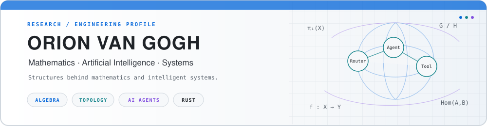
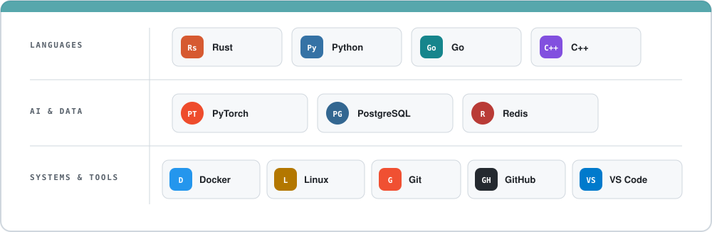
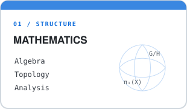
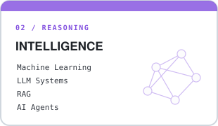
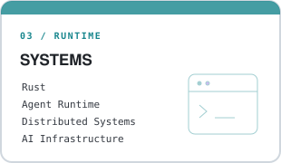
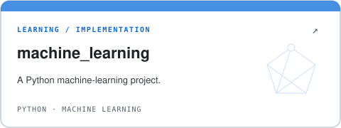
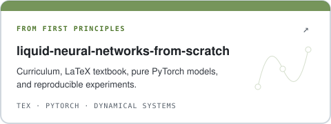
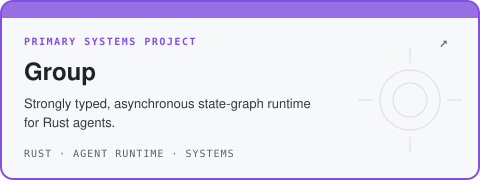
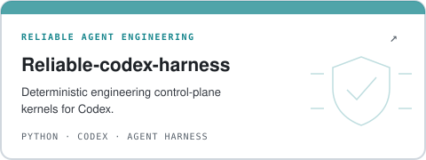

<picture>
  <source media="(prefers-color-scheme: dark)" srcset="./assets/header-dark.svg" />
  <source media="(prefers-color-scheme: light)" srcset="./assets/header-light.svg" />
  
</picture>

  

---

## 01 / PROFILE

<table>
  <tr>
    <td width="62%">
      Mathematics student working at the intersection of mathematics and computer science, especially algebra, topology, machine learning, and AI systems. I build primarily with Rust and Python, with Linux as my daily development environment.
    </td>
    <td width="38%">
      <strong><code>CURRENTLY EXPLORING</code></strong>  
      Agent Runtime 
      LLM Systems 
      Retrieval-Augmented Generation 
      Distributed Agent Architectures
    </td>
  </tr>
</table>

---

## 02 / TOOLBOX

<picture>
  <source media="(prefers-color-scheme: dark)" srcset="./assets/toolbox-dark.svg" />
  <source media="(prefers-color-scheme: light)" srcset="./assets/toolbox-light.svg" />
  
</picture>

---

## 03 / INTERESTS

  <picture>
    <source media="(prefers-color-scheme: dark)" srcset="./assets/interests-math-dark.svg" />
    <source media="(prefers-color-scheme: light)" srcset="./assets/interests-math-light.svg" />
    
  </picture>
  <picture>
    <source media="(prefers-color-scheme: dark)" srcset="./assets/interests-ai-dark.svg" />
    <source media="(prefers-color-scheme: light)" srcset="./assets/interests-ai-light.svg" />
    
  </picture>
  <picture>
    <source media="(prefers-color-scheme: dark)" srcset="./assets/interests-systems-dark.svg" />
    <source media="(prefers-color-scheme: light)" srcset="./assets/interests-systems-light.svg" />
    
  </picture>

---

## 04 / SELECTED WORK

  <a href="https://github.com/VanGogh-7/machine_learning">
    <picture>
      <source media="(prefers-color-scheme: dark)" srcset="./assets/project-machine-learning-dark.svg" />
      <source media="(prefers-color-scheme: light)" srcset="./assets/project-machine-learning-light.svg" />
      
    </picture>
  </a>
  <a href="https://github.com/VanGogh-7/liquid-neural-networks-from-scratch">
    <picture>
      <source media="(prefers-color-scheme: dark)" srcset="./assets/project-liquid-neural-networks-dark.svg" />
      <source media="(prefers-color-scheme: light)" srcset="./assets/project-liquid-neural-networks-light.svg" />
      
    </picture>
  </a>

  <a href="https://github.com/VanGogh-7/Group">
    <picture>
      <source media="(prefers-color-scheme: dark)" srcset="./assets/project-group-dark.svg" />
      <source media="(prefers-color-scheme: light)" srcset="./assets/project-group-light.svg" />
      
    </picture>
  </a>
  <a href="https://github.com/VanGogh-7/Reliable-codex-harness">
    <picture>
      <source media="(prefers-color-scheme: dark)" srcset="./assets/project-reliable-codex-harness-dark.svg" />
      <source media="(prefers-color-scheme: light)" srcset="./assets/project-reliable-codex-harness-light.svg" />
      
    </picture>
  </a>

---

## 05 / ACTIVITY

<picture>
  <source media="(prefers-color-scheme: dark)" srcset="https://raw.githubusercontent.com/VanGogh-7/VanGogh-7/output/profile-stats-dark.svg" />
  <source media="(prefers-color-scheme: light)" srcset="https://raw.githubusercontent.com/VanGogh-7/VanGogh-7/output/profile-stats-light.svg" />
  
</picture>

Language footprint is calculated from bytes reported by GitHub across public, non-fork repositories. It is repository composition, not a proficiency ranking.

---

## 06 / CONTRIBUTIONS

 

<picture>
  <source media="(prefers-color-scheme: dark)" srcset="https://raw.githubusercontent.com/VanGogh-7/VanGogh-7/output/github-contribution-grid-snake-dark.svg" />
  <source media="(prefers-color-scheme: light)" srcset="https://raw.githubusercontent.com/VanGogh-7/VanGogh-7/output/github-contribution-grid-snake.svg" />
  
</picture>

 

---

∫ mathematics · code · intelligence

